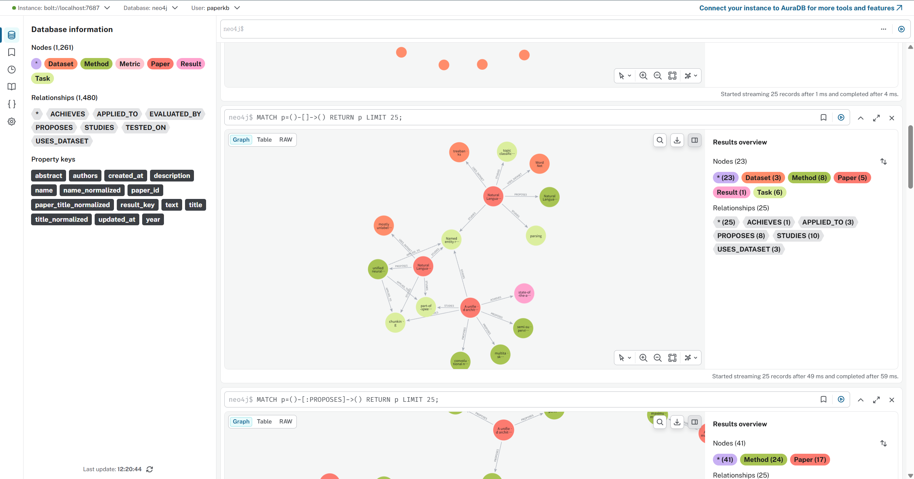
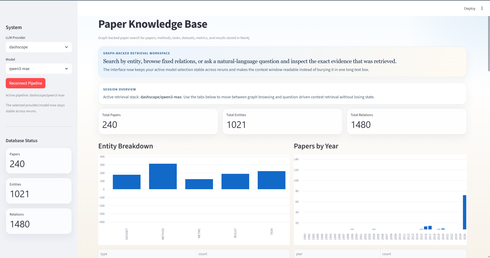
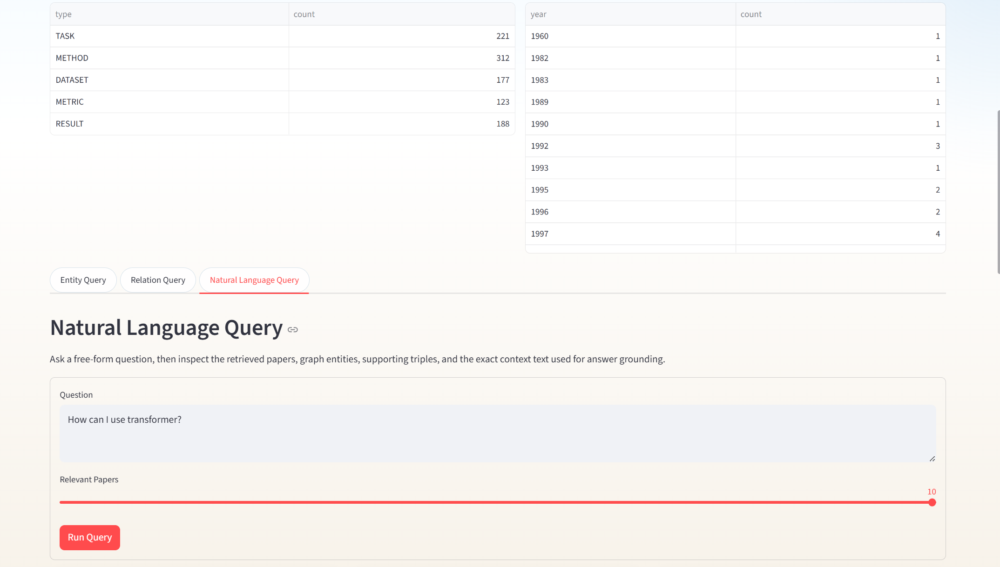
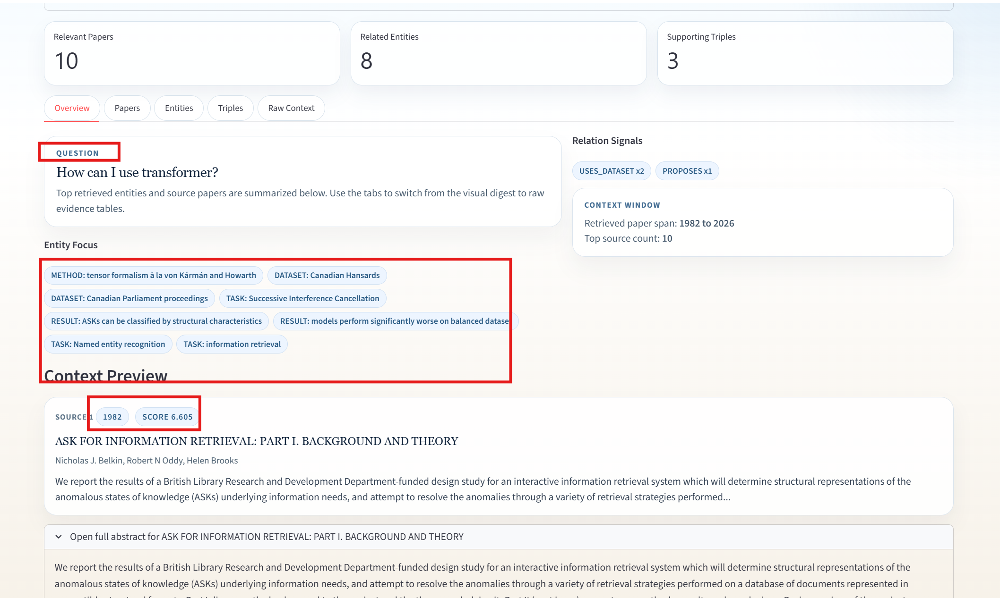
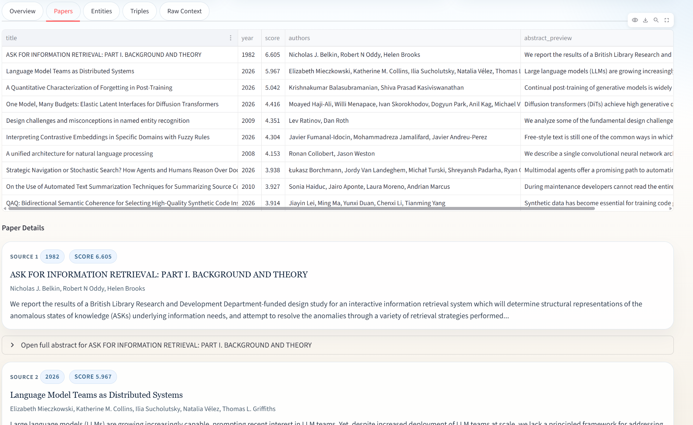

# Paper Knowledge Graph

A paper-centric knowledge graph project that turns paper metadata into structured entities and relations, stores them in Neo4j, and exposes the graph through a Streamlit query UI.

## What It Does

- Import paper records from `csv` and `jsonl`.
- Support legacy single-document ingestion from `docx` and `txt`.
- Extract `TASK`, `METHOD`, `DATASET`, `METRIC`, and `RESULT` from titles and abstracts with an LLM.
- Write papers, entities, and relations into Neo4j with a fixed schema.
- Provide entity query, relation query, and natural-language query views in Streamlit.
- Use `sentence-transformers` for semantic search when available, with TF-IDF fallback.

## Screenshots







## Tech Stack

- Python 3.10-3.12
- Neo4j 5.x
- Streamlit
- OpenAI / DashScope / Anthropic
- `pandas`, `python-docx`, `tiktoken`
- `scikit-learn`
- Optional: `sentence-transformers`

## Graph Schema

### Node Types

- `Paper`
- `Task`
- `Method`
- `Dataset`
- `Metric`
- `Result`

### Relation Types

- `Paper -[:STUDIES]-> Task`
- `Paper -[:PROPOSES]-> Method`
- `Paper -[:USES_DATASET]-> Dataset`
- `Paper -[:EVALUATED_BY]-> Metric`
- `Method -[:APPLIED_TO]-> Task`
- `Method -[:TESTED_ON]-> Dataset`
- `Method -[:ACHIEVES]-> Result`

## Project Layout

| Path | Purpose |
| --- | --- |
| `main.py` | CLI entry point for `process`, `web`, and `test` |
| `config.py` | Environment and runtime configuration |
| `document_processor.py` | Input normalization and chunk/token handling |
| `llm_extractor.py` | LLM-based entity and relation extraction |
| `neo4j_manager.py` | Neo4j schema, write, and query logic |
| `knowledge_graph_builder.py` | End-to-end pipeline and GraphRAG query helper |
| `query_interface.py` | Streamlit UI |
| `scripts/` | Utility scripts for Neo4j and Streamlit |
| `sample_papers.csv` | Small sample dataset |
| `data/papers_bootstrap_240.csv` | Larger bootstrap dataset |

## Setup

### Option 1: venv + Docker Neo4j

```bash
python -m venv .venv
# Windows PowerShell
.venv\Scripts\activate
# macOS / Linux
# source .venv/bin/activate
python -m pip install --upgrade pip
python -m pip install -r requirements.txt
cp .env.example .env
# Windows PowerShell: Copy-Item .env.example .env
docker compose up -d neo4j
```

To enable dense semantic search:

```bash
python -m pip install -r requirements-optional.txt
```

### Option 2: Conda

```bash
conda env create -f environment.yml
conda activate paper-kb
pip install -r requirements-optional.txt
cp .env.example .env
# Windows PowerShell: Copy-Item .env.example .env
docker compose up -d neo4j
```

### Option 3: Local or Bundled Neo4j

If `runtime/jdk-21` and `runtime/neo4j` exist, you can start the bundled Neo4j directly:

```powershell
.\scripts\start_neo4j.ps1
```

The script prefers the bundled Neo4j runtime and falls back to `docker compose up -d neo4j` when the local runtime is missing.

## Environment Variables

Create the local environment file first:

```bash
cp .env.example .env
# Windows PowerShell: Copy-Item .env.example .env
```

Required settings:

- `NEO4J_URI`
- `NEO4J_USERNAME`
- `NEO4J_PASSWORD`
- At least one LLM API key:
- `OPENAI_API_KEY`
- `DASHSCOPE_API_KEY`
- `ANTHROPIC_API_KEY`

Example DashScope configuration:

```env
NEO4J_URI=bolt://localhost:7687
NEO4J_USERNAME=neo4j
NEO4J_PASSWORD=please-change-this-password

DASHSCOPE_API_KEY=your_dashscope_api_key
DASHSCOPE_BASE_URL=https://dashscope.aliyuncs.com/compatible-mode/v1
DEFAULT_LLM_MODEL=qwen3-max
```

## Quick Start

### 1. Import the sample dataset

```bash
python main.py process sample_papers.csv --provider dashscope --model qwen3-max --clear-database
```

### 2. Start the web UI

```bash
python main.py web
```

Or on Windows:

```powershell
.\scripts\start_streamlit.ps1
```

### 3. Process and open the UI in one command

```bash
python main.py process sample_papers.csv --provider dashscope --model qwen3-max --web
```

### 4. Fetch public paper sources

```bash
python scripts/fetch_paper_sources.py --count 240 --output data/papers_bootstrap_240.csv
```

### 5. Import paper metadata only

```bash
python scripts/import_papers_only.py data/papers_bootstrap_240.csv --clear-database
```

### 6. Run batch extraction

```bash
python main.py process data/papers_bootstrap_240.csv --provider dashscope --model qwen3-max --start 0 --count 40
```

Continue with:

- `--start 40 --count 40`
- `--start 80 --count 40`
- `--start 120 --count 40`
- `--start 160 --count 40`
- `--start 200 --count 40`

## UI Refresh Notes

The Streamlit query interface was refreshed in April 2026.

- Provider and model selection now persist across reruns instead of silently falling back to defaults.
- Pipeline initialization is cached and can be refreshed explicitly from the sidebar.
- Natural-language query results are split into `Overview`, `Papers`, `Entities`, `Triples`, and `Raw Context` tabs.
- `Context Preview` now uses readable paper cards with expandable abstracts instead of a single disabled text box.
- Entity and relation searches keep their latest results in session state, which makes live demos smoother.

## Demo Flow

1. Start Neo4j with `.\scripts\start_neo4j.ps1` or `docker compose up -d neo4j`.
2. Launch the app with `python main.py web` or `.\scripts\start_streamlit.ps1`.
3. Open `Natural Language Query` and ask `What methods are used for text summarization?`.
4. Use the `Overview` tab to show retrieved entities and relation signals.
5. Use the `Papers` and `Raw Context` tabs to show the exact evidence behind the result.

## Input Formats

Supported inputs:

- `csv`
- `jsonl`
- `docx`
- `txt`

`csv` and `jsonl` require at least:

- `title`
- `abstract`

Optional fields:

- `paper_id`
- `year`
- `authors`

Supported aliases:

- `paper_title` -> `title`
- `summary` -> `abstract`
- `id` / `arxiv_id` -> `paper_id`
- `published_year` -> `year`
- `author` -> `authors`

Not supported:

- `pdf`
- `doc`

## How It Works

1. `main.py process` reads the source file.
2. `document_processor.py` normalizes paper records.
3. `llm_extractor.py` extracts entities and relations with an LLM.
4. `neo4j_manager.py` writes `Paper` nodes, entity nodes, and graph relations.
5. `query_interface.py` reads from Neo4j and renders the Streamlit UI.

## Notes and Limitations

- The natural-language view is retrieval plus context display, not final answer generation.
- `Result` nodes are still relatively free-form text and can become noisy at larger scale.
- Without `sentence-transformers`, semantic search falls back to TF-IDF.
- `python main.py test` is a lightweight smoke test; LLM checks will fail if API keys are missing.
